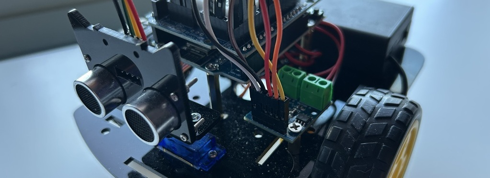
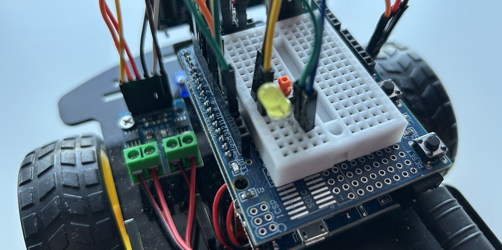

# :wrench: Smart Robot Car :car:

## Overview

This project replicates a school robotics assignment: programming a smart robot car capable of navigating a maze by detecting obstacles and determining a path to the end using distance estimation

<b>Objectives</b>
- Navigate through a maze autonomously
- Detect and avoid obstacles using an ultrasonic sensor
- Reach the end of the maze without manual control

:heavy_check_mark: Check the folders ending in `*-tester` for component verification  
:heavy_check_mark: For final results, see the `/vacuum` directory for **v1** and `/maze-runner` for **v2**

## Hardware Components

Components included in the base kit:
- WeMos D1 WiFi Development Board (ESP8266) with expansion board
- L9110 Motor Driver Module, Controls two DC motors for forward and backward movement
- Two wheels and Universal Ball Wheel
- SG90 Servo Motor, rotates the HC-SR04 Ultrasonic Sensor which allows distance measurement across different angles

Miscellaneous:
- Jumper wires
- Battery box
- Mounting hardware (plates, pillars, screws, etc.)

Additional components:
- Yellow LED for distance status indication
- Push Button for manual start or mode selection
- Lithium-Ion Batteries for power supply

## Software & Tools

- Arduino IDE & VSCode

Board:
- LOLIN(WeMos) D1 R1 board (esp8266), uses custom library not provided by Arduino Library Manager
- Package URL: http://arduino.esp8266.com/stable/package_esp8266com_index.json

Libraries:
- Servo.h (for controlling the SG90 servo)
